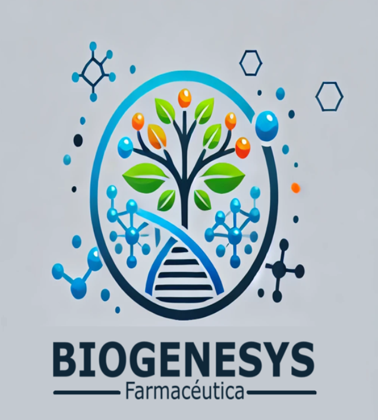

# 🌍 Expansión Estratégica de Laboratorios Farmacéuticos en Latinoamérica

> 🧪 **Proyecto Integrador | Módulo 4 - Data Analyst - Henry**

  

## 📊 Descripción del Proyecto

Este proyecto fue desarrollado como parte del **módulo final de la carrera Data Analyst de Henry**, con el objetivo de aplicar de forma integral técnicas de análisis de datos a un problema real de salud pública con impacto regional.

La propuesta consiste en **identificar ubicaciones óptimas en Latinoamérica** para la expansión estratégica de laboratorios farmacéuticos, teniendo en cuenta:

- 📈 Tasas de incidencia de **COVID-19**
- 💉 Niveles de **vacunación**
- 🏥 Disponibilidad de **infraestructura sanitaria**

Todo esto con el fin de **mejorar el acceso a vacunas** y optimizar la respuesta sanitaria en contextos de pandemia y postpandemia.

---

## 🛠️ Herramientas Utilizadas

- **Power BI** para visualización interactiva de los datos  
- **Excel / Power Query** para limpieza y transformación inicial  
- Diseño guiado por principios de **dashboard storytelling** y **visual analytics**

---

## 🧠 Objetivos del Análisis

- Identificar países con mayor necesidad y capacidad de absorción de nuevas instalaciones farmacéuticas
- Evaluar correlaciones entre infraestructura médica, tasas de vacunación y casos de COVID-19
- Generar visualizaciones claras y accionables para toma de decisiones estratégicas

---

## 📌 Principales Insights

- Países con baja cobertura vacunal y alta infraestructura disponible presentan oportunidades clave.
- Algunas regiones han mejorado significativamente su capacidad de respuesta postpandemia.
- Factores sociales y económicos también influyen en la viabilidad de expansión.

---
